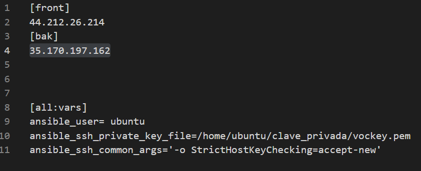
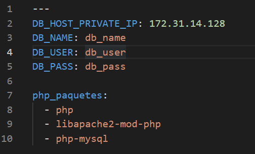
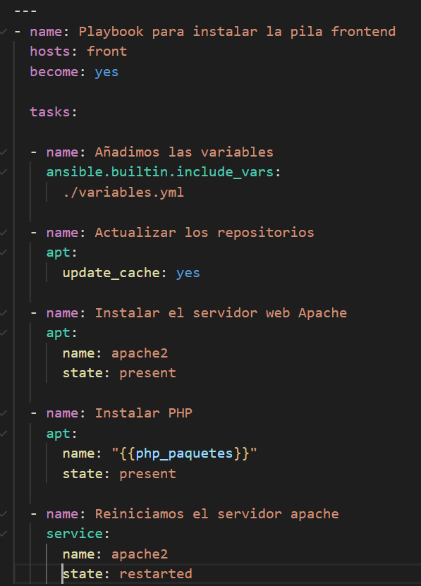
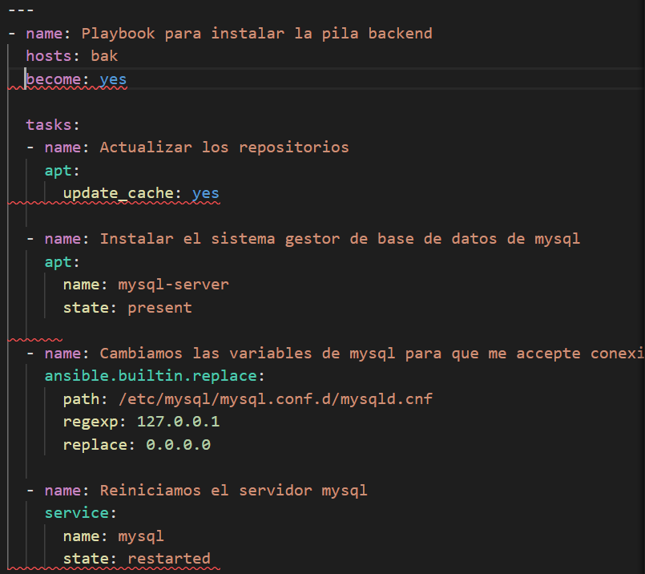

# Práctica 7: Arquitectura de una aplicación web LAMP en dos niveles

Vamos a configurar dos máquinas virtuales para que en una se encargue de gestionar las peticiones webs y la otra la base de datos.

La arquitectura estará formada por:

* **Una capa de front-end, formada por un servidor web con Apache HTTP Server.**
* **Una capa de back-end, formada por un servidor MySQL.**

## Primeros pasos

Tenemos que hacer **dos grupos** uno es para el front-end y el otro grupo back-end es para el servidor de mysql.

Pondremos las IP en el grupo que le corresponda, los grupos que definamos aquí, tendremos que llamarlos en los archivos con extensión **.yml** para decirles que esos equipos queremos que se apliquen las condiciones definidas.

## Archivos de las Variables

Creo un archivo con las variables que voy a definir, así no tengo que crearlas varias veces.

* **DB_HOST_PRIVATE_IP** es la IP privada de mysql que usaremos más adelante.

* **DB_NAME** es el nombre de la base de datos.

* **DB_USER** Es el nombre de los usuarios de la base de datos.

* **DB_PASS** es la contraseña de la base de datos.

Las siguientes lineas es para crear una lista que me instale PHP y sus extensiones (esto lo utilizaremos para el servidor de apache).

## Explicación de front-end (Instalación)

*Voy a explicar la instalación que requiere **front-end** , para atender peticiones*

Llamo al grupo generado en el **invetario** que será para los sistemas que pertenezcan a **front-end**

* La primera acción que haga , **quiero que me busque las variables que he geneado en el archivo variables.yml**

* **Le digo que me actualice los repositorios.**

* **Instalación el servidor de apache**

* **Importante, ahora usaremos la variables que he declarado en el fichero , que son los paquetes y extensiones de php**

* **Por último, reiniciamos el servidor de apache**

## Explicación de back-end (Instalación)

Recordar que esta parte es dedicado al servidor de mysql.

Declaramos que el grupo es **bak**

* **Actualizamos los repositorios.**

* **Instalamos mysql.**

Con la instalación de mysql, se nos generará un archivo que tendremos que modificar , para que no nos rechaze las conexiones y acepte conexiones desde cualquier interfaz.

* **Por defecto está la dirección 127.0.0.1 que es para **localhost** habrá que reemplazar por 0.0.0.0, ponemos la ruta completa del directorio donde esté ubicado el archivo.**

* **Reiniciamos el servidor de apache**

