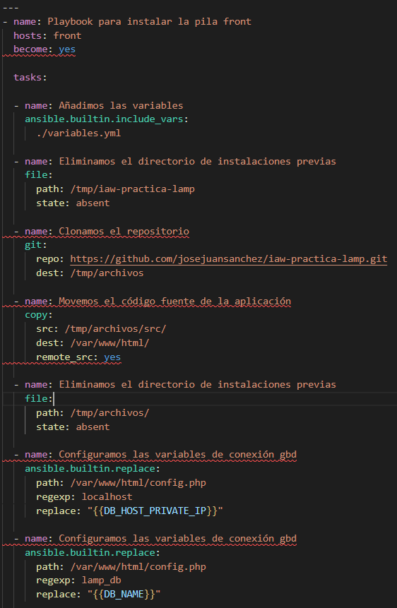
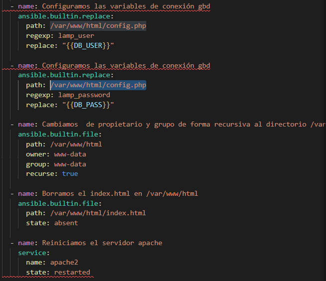
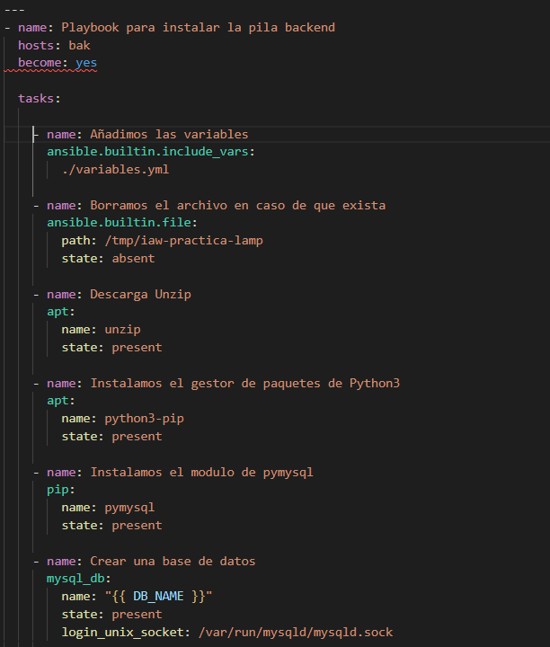
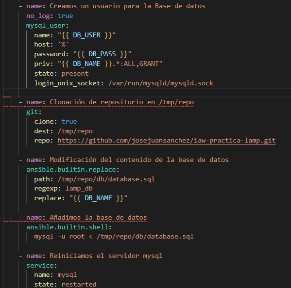
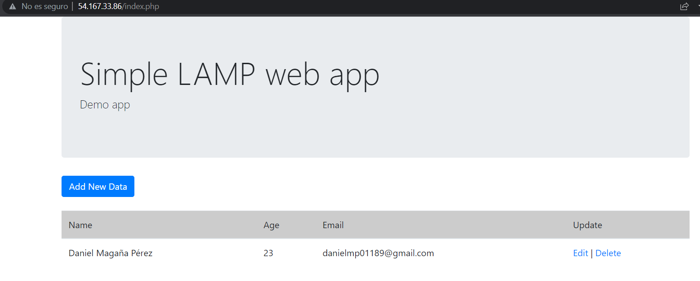
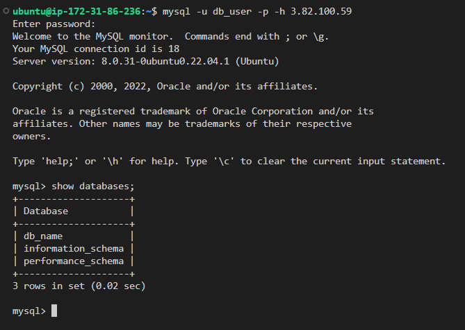

# Práctica 7: Arquitectura de una aplicación web LAMP en dos niveles

Vamos a configurar dos máquinas virtuales para que en una se encargue de gestionar las peticiones webs y la otra la base de datos.

La arquitectura estará formada por:

* **Una capa de front-end, formada por un servidor web con Apache HTTP Server.**
* **Una capa de back-end, formada por un servidor MySQL. (hay que añadir el puerto 3306, es el puerto de mysql)**

## Primeros pasos

Tenemos que hacer **dos grupos** uno es para el front-end y el otro grupo back-end es para el servidor de mysql.

Pondremos las IP en el grupo que le corresponda, los grupos que definamos aquí, tendremos que llamarlos en los archivos con extensión **.yml** para decirles que esos equipos queremos que se apliquen las condiciones definidas.

## Archivos de las Variables

Creo un archivo con las variables que voy a definir, así no tengo que crearlas varias veces.

* **DB_HOST_PRIVATE_IP** es la IP privada de mysql que usaremos más adelante.

* **DB_NAME** es el nombre de la base de datos.

* **DB_USER** Es el nombre de los usuarios de la base de datos.

* **DB_PASS** es la contraseña de la base de datos.

Las siguientes lineas es para crear una lista que me instale PHP y sus extensiones (esto lo utilizaremos para el servidor de apache).

## Explicación de front-end (Instalación)

*Voy a explicar la instalación que requiere **front-end** , para atender peticiones*

Llamo al grupo generado en el **invetario** que será para los sistemas que pertenezcan a **front-end**

* La primera acción que haga , **quiero que me busque las variables que he geneado en el archivo variables.yml**

* **Le digo que me actualice los repositorios.**

* **Instalación el servidor de apache**

* **Importante, ahora usaremos la variables que he declarado en el fichero , que son los paquetes y extensiones de php**

* **Por último, reiniciamos el servidor de apache**

## Explicación de back-end (Instalación)

Recordar que esta parte es dedicado al servidor de mysql.

Declaramos que el grupo es **bak**

* **Actualizamos los repositorios.**

* **Instalamos mysql.**

Con la instalación de mysql, se nos generará un archivo que tendremos que modificar , para que no nos rechaze las conexiones y acepte conexiones desde cualquier interfaz.

* **Por defecto está la dirección 127.0.0.1 que es para **localhost** habrá que reemplazar por 0.0.0.0, ponemos la ruta completa del directorio donde esté ubicado el archivo.**

* **Reiniciamos el servidor de apache**

## Explicación de front-end (Configuración)

Declaramos al grupo que le corresponde en este caso es para **front**

* **Llamamos a los archivos de las variables**

* **Voy a hacer un git clone del repositorio del profesor donde estará el archivo donde podremos añadir información a la base de datos desde el navegador, aunque antes intentaré eliminarlo en el caso de que esté en el equipo**

* **Movemos los archivos de src al directorio /var/www/html**

Configuramos las variables para la base de datos dentro del archivo config.php que está en el direcotrio /var/www/html/ , es importante entender que lo único que voy a hacer aquí es cambiar el contenido poniendo información sobre el back-end.

* **DB_HOST_PRIVATE_IP** tendrá la ip privada de mysql (del servidor), le decimos que me busque el carácter localhost dentro del archivo y que me lo reemplace por esta variable.

* **DB_NAME** Ponemos el nombre de la base de datos que le hemos dicho en el archivo de las variables, el contenido de esa variable se insertará al archivo config.php en el lugar de lamp_db.

* **DB_USER** Buscamos la variable db_user (este apartado es para definir los usuarios) y cambiamos esa variable por el contenido que hemos creado con anterioridad.

* **Ahora, cambiaremos los permisos de los archivos **/var/www/html** poniendo de propietarios www-data al igual que de grupo.**

* **Borramos el index.html para que no me coja por defecto el archivo index.html, para que me coja la página index.php**

* **Reinicamos el servidor de apache**

## Explicación de back-end (Configuración)

En este paso ponemos creamos y configuramos la base de datos y demás.

* **Hacemos un llamamiento al archivo de las variables**

* **En referencia al anterior paso de este grupo podría estár la clonación así que la borramos**

* **Descargamos el programa con el que podremos descomprimir**

* **Instalamos el gestor de paquetes de Python3**

* **Ahora aprovecharemos el instalador de paquetes para instalar pymysql**

Los siguientes pasos es para la configuración de la base de datos de la base de datos.

* **Crear la base de datos, con la variables definidas en el archivo de las variables, crearemos una base de datos con el nombre establecido**

* **Añadimos un usuario a la base de datos, con su contraseña y establecemos los privilegios que tendrá dicho usuario en la base de datos.**

* **Modificación del contenido de la base de datos, cambiamso el nombre de la base de datos por dentro, hacemos que nos busque su nombre actual y que lo intercambie.**

* **Añadimos la base de datos al mysql**

* **Reiniamos apache**

## ¿Cómo sé que me funciona?

Lo primero de todo tenfo que poner en el navegador la IP de front-end que me llevará directamente, a la página que me dejará añadir información.

Lo siguiente es que debería dejarme conectar desde front-end al back-end de manera que entraría con el usuario que hemos creado(me refiero al acceso de mysql).

Ponemos el comando **mysql -u db_user -p -h (ip_mysql_publica).**

db_user es el usuario que hemos creado.

